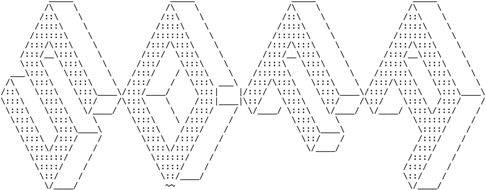

# SDFA: An Efficient Framework for Structural Variation Analysis


<div align="center">  </div>


SDFA (SDF-based Analyzer) is a comprehensive framework designed for accurate and rapid parsing, storage, and analysis of structural variation (SV) data within large population samples. It introduces a novel Standardized Decomposition Format (SDF) for efficient SV representation, and provides modules for merging, annotation, and quantitative gene feature assessment.

<p>
  <a href="#key-features">Key Features</a> |
  <a href="#getting-started">Getting Started</a> |
  <a href="#usage">Usage</a> |
  <a href="#documentation">Documentation</a> |
  <a href="#license">License</a> |
  <a href="#acknowledgments">Acknowledgments</a>
</p>

## Key Features

- <kbd>**Standardized Decomposition Format(SDF)**</kbd>: A novel format for standardizing, compressing, and storing various types of SVs arranged in genomic coordinates with indexes.
- <kbd>**Population-scale SV Merge**</kbd>: A chromosome-level merging procedure for analyzing population samples, ensuring stable merging independent of the input order of samples and enabling efficient parallel processing.
- <kbd>**Incremental Index Annotation**</kbd>: A light and fast annotation algorithm for annotating SVs with multiple resources, without repeatedly scanning the resource data.
- <kbd>**Numeric Gene Feature (NGF) Annotation**</kbd>: A numeric and efficient assessment of the impact of SVs on genes, addressing the complexity and lengthiness of current gene feature annotations.

## Getting Started

### Prerequisites

- Java 8 or later
- SDFA jar

### Installation

1. Clone the repository:

```bash
git clone https://github.com/Overinterested/SDFA.git
```

2. Navigate to the project directory:

```bash
cd SDFA
```

3. Compile the project:

```bash
mvn clean install
```

## Usage

The SDFA command-line tool supports various functionalities, including VCF to SDF conversion, merging, annotation, and numeric gene feature annotation. Here are some examples:

**VCF to SDF Conversion**

```bash
java -jar SDFA.jar vcf2sdf -f input.vcf -o output_dir
```

**Show SDF file Content**

```shell
java -jar SDFA.jar gui -f input.sdf
```

**Merging**

```bash
java -jar SDFA.jar merge -dir input_dir -o output_dir
```

**Annotation**

```bash
java -jar SDFA.jar annotate -dir input_dir -o output_dir --annot-config annotation.config
```

**Numeric Gene Feature Annotation**

```bash
java -jar SDFA.jar ngf -dir input_dir -o output_dir --hg38 --gene-level
```

For more detailed information on available options and configurations, refer to the command-line help:

```bash
java -jar SDFA.jar [function] --help
```

## Documentation

Detailed documentation, including installation instructions, usage examples, and API reference, can be found in the [project wiki](https://github.com/Overinterested/SDFA/wiki).

## License

This project is licensed under the MIT License.

## Acknowledgments

- List any third-party libraries or resources used in the project.
- Acknowledge any individuals or organizations who contributed to the project.

## Contact

For any questions or inquiries, please contact the project maintainers at overinterested.sysu@gmail.com.

