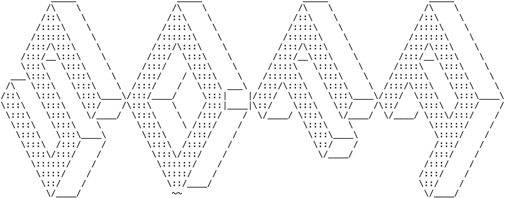
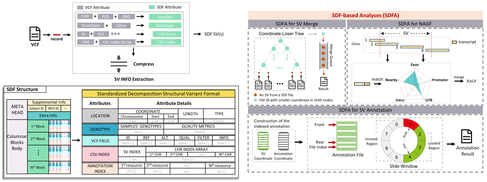

# SDFA: An Efficient Framework for Structural Variation Analysis


<div align="center"> 
     
</div>

SDFA (SDF-based Analyzer) is a novel computational framework designed for accurate and rapid parsing, storage, and analysis of structural variation (SV) data within large population samples. It introduces a novel Standardized Decomposition Format (SDF) for efficient SV representation and provides modules for merging, annotation and numeric annotation of gene feature(NAGF).

<p align="center">
    <a href="#key-features">
        Key Features
    </a>
    |
    <a href="#getting-start">
        Getting Start
    </a>
    |
    <a href="#usage">
        Usage
    </a>
    |
    <a href="#documentation">
        Documentation
    </a>
    |
    <a href="#license">
        License</a>
    |
    <a href="#acknowledgments">
        Acknowledgments
    </a>
</p>
## Key Features



- <kbd>**Standardized Decomposition Format(SDF)**</kbd>: A novel format for standardizing, compressing, and storing various types of SVs arranged in genomic coordinates with indexes.
- <kbd>**Sample-wide SV Merge**</kbd>: A sample-wide merging procedure for analyzing population samples, ensuring a robust and efficient merging procedure.
- <kbd>**Indexed sliding-window Annotation**</kbd>: A light and fast annotation algorithm for annotating SVs with multiple resources, without repeatedly scanning the resource data.
- <kbd>**Numeric Annotation of Gene Feature (NAGF)**</kbd>: A numeric and efficient assessment of the impact of SVs on genes, addressing the complexity and lengthiness of current gene feature annotations.
- <kbd>**SV-based GWAS Pipeline**</kbd>: A SV-based GWAS analysis for large-scale population was constructed combined with Plink.

## Getting Start

### Prerequisites

- Java 8 or later
- Plink (if conducting SV-based GWAS)

### Installation

1. Clone the repository:

```bash
git clone https://github.com/Overinterested/SDFA.git
```

2. Navigate to the project directory:

```bash
cd SDFA
# the latest .jar is SDFA.jar in current dir
java -jar SDFA.jar -h  
```

## Usage

The SDFA command-line tool supports various functionalities, including conversion from VCF to SDF, sample merge, SV annotation, and numeric annotation of gene feature(NAGF) for SVs. Here are some examples:

- <a href="#vcf2sdf">VCF2SDF Convertor</a>
- <a href="#gui">SDF GUI</a>
- <a href="#merge">Sample Merge</a>
- <a href="#annotation">Function Annotation</a>
- <a href="#nagf">NAGF for SV</a>
- <a href="#sv_gwas">SV-based GWAS</a>

<a name="vcf2sdf"></a>
**VCF to SDF Conversion**

```bash
java -jar SDFA.jar vcf2sdf -f input.vcf -o output_dir
```

<a name="gui"></a>**Show SDF file Content**

```shell
java -jar SDFA.jar gui -f input.sdf
```

<a name="merge"></a>**Merging**

```bash
java -jar SDFA.jar merge -dir input_dir -o output_dir
```

<a name="annotation"></a>**Annotation**

```bash
java -jar SDFA.jar annotate -dir input_dir -o output_dir --annot-config annotation.config
```

<a name="ngf"></a>**Numeric Gene Feature Annotation**

```bash
java -jar SDFA.jar ngf -dir input_dir -o output_dir --hg38 --gene-level
```
<a name="sv_gwas"></a>**SV-based GWAS**

Here, we consider several split VCF files, which can be combined to form a complete population VCF file for a large-scale sample (similar to the organization of SV files in the UK Biobank). Therefore, we need to complete the following steps:

- <a name="concat">SDF Concat</a>: Concat mutiple vcf files into one file in coordinate order.
- <a name="extract">Samples Extraction</a>: Extract partial samples from the concat vcf file using `ped` file
- <a name="sdf2plink">SDF2Plink</a>: Convert the sdf files to plink format files

- <a name="plink">Plink For GWAS</a>: Use plink to conduct the GWAS for SV

<a name="extract"></a>**Extract part subject from SDF**

```bash
java -jar SDFA.jar extract -f input.sdf --extract-subject ped.file --ped-file -o output_dir
```
<a name="concat"></a>**SDF Concat**

```bash
java -jar SDFA.jar concat -dir sdf_dir -o output_dir -threads 4
```
<a name="sdf2plink"></a>**SDF2Plink**
> Produce `.fam`, `.bed` and `.bim`
```bash
java -jar SDFA.jar sdf2plink -f sdf_file_path -o output_dir
```

For more detailed information on available options and configurations, refer to the command-line help:

```bash
java -jar SDFA.jar [function] --help
```

## Documentation

Detailed documentation, including installation instructions, usage examples, and API reference, can be found in the [project wiki](https://github.com/Overinterested/SDFA/wiki).

## License

This project is licensed under the MIT License.

