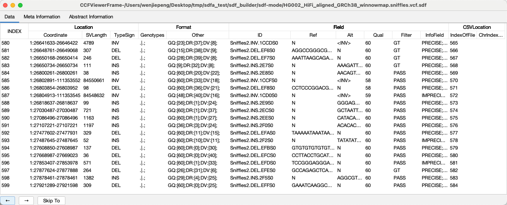
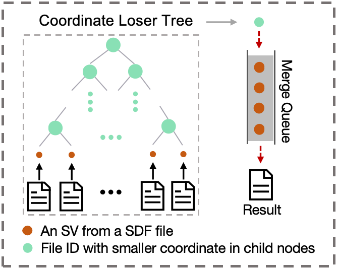
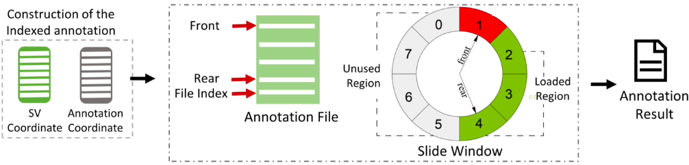
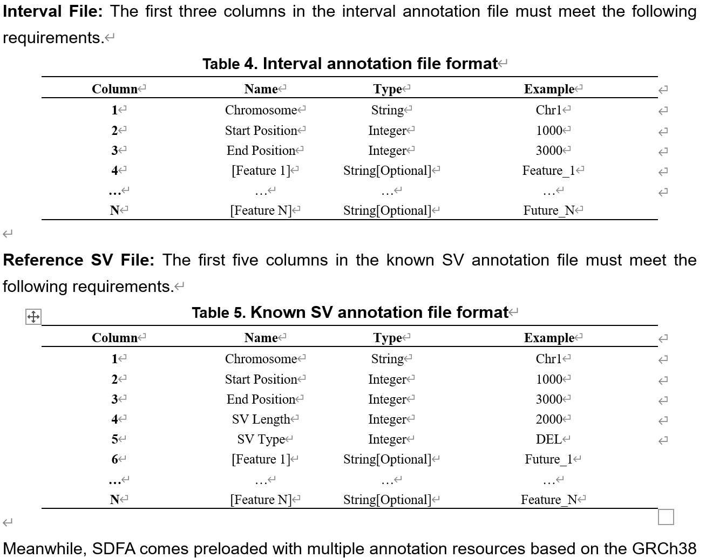

# SDFA Project Wiki

## Overview
- Introduction

  SDFA is an efficient computational tool designed for large-scale structural variation (SV) analysis. It is based on a new SV storage format and includes a suite of companion tools. Specifically, it utilizes a Standardized Decomposition Format (SDF) to efficiently store and retrieve various types of structural variations. SDFA also incorporates multiple algorithms for large-scale SV analysis, applicable to SV sample merging and SV annotation. Additionally, SDFA has developed a novel numerical gene feature annotation method to quantify the impact of SVs on gene features.

- Key Concepts

  - **Efficient SV data storage and retrieval**: Implemented through the SDF format.

  - **Consistent and robust SV merging algorithm**: Capable of handling large-scale sample data.
  - **Fast and memory-efficient SV annotation**: Using indexed sliding window algorithms.
  - **Novel precise gene feature annotation**: Using the Numerical Annotation of Gene Feature (NAGF) method.
  - **Superior performance**: At least 17.64 times faster in SV merging and 120.93 times faster in annotation.
  - **Ability to parse and annotate complex SVs**: The only tool that can correctly handle nested complex SVs.
  - **Strong scalability**: Successfully processed 895,054 SVs from 150,119 individuals in the UK Biobank dataset, where other methods failed.
  - **Parallel processing capability**: Can utilize multi-threading to improve processing speed.
  - **Flexible customization**: Such as user-defined filtering conditions and annotation resources.

- Installation
  
    SDFA is developed based on Oracle JDK 8, and any computing device that supports or is compatible with Oracle JDK 8 can use our software. Users need to first download and install [Oracle JDK](https://www.oracle.com/java/technologies/javase-downloads.html) or [Open JDK](https://openjdk.java.net/install/). Apple Silicon devices can use [Zulu JDK](https://www.azul.com/downloads/?package=jdk#download-openjdk) as an alternative. Additionally, we also provide a Dockerfile to build a GBC runtime environment image.
    
    | Resource Type         | Path                                                         |
    | :-------------------- | :----------------------------------------------------------- |
    | **Software Package**  | https://github.com/Overinterested/SDFA/blob/master/SDFA.jar  |
    | **Source Code**       | https://github.com/Overinterested/SDFA/tree/master/src       |
    | **API Documentation** |                                                              |
    | **Sample Files**      | **1. VCF Test Files:** [1100 VCF files](https://zenodo.org/records/13293672)<br>**2. VCF Family Files:** http://data.schatz-lab.org/jasmine/HG002Trio/UnmergedVCFs/<br>**3. Annotation Resource Files:**https://zenodo.org/records/13293672 |
    

## Usage

### 1. Build SDF Archive

#### 1.1 VCF to SDF Conversion

SDFA provides conversion from VCF files to SDF files for standard diploid species, enabling fast SV addressing, quick access to SVs and their related properties, and VCF file compression. By default, SDFA-1.0 preserves all information in VCF files, including header information, all SV INFO fields, and Genotype Metric fields, without filtering SVs. When a VCF file contains multiple samples, we store the sample names in the Meta section of the SDF. On the command line, use the following command to build an SDF archive for SV VCF files:

``` sh
java -jar sdfa.jar vcf2sdf <input> [output] [options]
```

During the build process, SDFA constructs chromosome indices based on the contig information in the header. If unknown chromosomes appear in SV information, they follow the [chromosome tag declaration](https://pmglab.top/gbc/en/extension/chromosome.html) to add indices sequentially. In addition to accepting raw VCF files, this command also supports VCF files in the following compressed formats: GZ, BGZ.

> - <font color="#0D3869">**Example 1**</font>
>
> Use SDFA to build SDF archives for the example file  and its bgz, gz compressed files, and output to the folder `~/tmp`. The commands to complete this task are as follows:
>
> ``` shell
> # Run directly in terminal
> ## Original vcf file
> java -jar /Users/wenjiepeng/projects/sdfa_latest/SDFA.jar vcf2sdf \
> -f ./HG002_HiFi_aligned_GRCh38_winnowmap.sniffles.vcf \
> -o ~/tmp
> ## vcf.gz file
> java -jar /Users/wenjiepeng/projects/sdfa_latest/SDFA.jar vcf2sdf \
> -f ./HG002_HiFi_aligned_GRCh38_winnowmap.sniffles.vcf.gz \
> -o ~/tmp
> ## vcf.bgz file
> java -jar /Users/wenjiepeng/projects/sdfa_latest/SDFA.jar vcf2sdf \
> -f ./HG002_HiFi_aligned_GRCh38_winnowmap.sniffles.vcf.bgz \
> -o ~/tmp
> ```

> - <font color="#0D3869">**Example 2**</font>
>
> Use SDFA to build SDF archives for all VCF files (including their compressed formats) in a specified directory. In MacOS or Linux terminal environments, you can run the following commands:
>
> ``` shell
> # Initialize input and output folders
> wget xxx
> gzip xxx
> data_dir="./vcf_data"
> cd ${data_dir}
> 
> # Use -f command to convert only .vcf.gz files
> for file in ${data_dir}/*.vcf.gz
> do
> java -jar sdfa.jar vcf2sdf ${file} ~/tmp/$(basename "$file" .vcf.gz).sdf -o ~/tmp
> done
> 
> # Use -dir command to convert all VCF files (including compressed formats)
> java -jar sdfa.jar vcf2sdf -dir $data_dir -o ~/tmp
> ```

Additionally, for more customized output for developers, we showcase the API code: The API tool for converting VCF files to SDF files is [SDF2VCF.class](), used as follows:

``` java
// Convert a single file
new VCF2SDF("test.vcf","output_dir").convert();
```

#### 1.2 SDF Storage Mode

To reduce storage size and meet different scenario requirements, SDF files incorporate 4 built-in storage modes. The first 3 storage modes are lossless compression formats, with only the last one being a lossy compression format (losing genotype annotation information). Additionally, SDFA supports custom encoding of SV properties to further reduce storage size or enable quick information retrieval.

##### 1.2.1 Mode 0

- `Mode 0` is the default storage mode in the VCF2SDF functionality, and subsequent modes are extensions based on Mode 0. This mode preserves all original VCF information with the following characteristics:
  - **Multiple copies**: Standard split SVs all contain INFO, genotype metric, and other field information from the SV before splitting.
  - **No encoding state**: INFO, genotype metric, and other fields are stored as String type.

> - <font color="#0D3869">**Example 3**</font>
>
> Use SDFA to build an SDF-Mode_0 archive for the example file `xxx` and output to the folder `~/tmp`. The command to complete this task is as follows:
>
> ``` shell
> java -jar /Users/wenjiepeng/projects/sdfa_latest/SDFA.jar vcf2sdf \
> -f /Users/wenjiepeng/Desktop/tmp/sdfa_test/sdf_builder/sdf-mode/HG002_HiFi_aligned_GRCh38_winnowmap.sniffles.vcf \
> -c 0 \
> -o ~/tmp
> ```

##### 1.2.2 Mode 1

- `Mode 1` builds on `Mode 0` by applying a built-in simple encoding method to the REF and ALT fields of Field properties:
  - Uses 2 bits to encode nucleotide bases in the two fields: A (00), T (01), C(10), and G(11).
  - If a field is not a basic sequence, the original value is still stored as String type in the SDF file.

> - <font color="#0D3869">**Example 4**</font>
>
> Use SDFA to build SDF archives for all VCF files (including compressed formats) in a specified directory. In MacOS or Linux terminal environments, you can run the following commands:
>
> ``` shell
> # Initialize input and output folders
> data_dir="xx/data"
> java -jar /Users/wenjiepeng/projects/sdfa_latest/SDFA.jar vcf2sdf \
> -f /Users/wenjiepeng/Desktop/tmp/sdfa_test/sdf_builder/sdf-mode/HG002_HiFi_aligned_GRCh38_winnowmap.sniffles.vcf \
> -c 1 \
> -o ~/tmp
> ```

##### 1.2.3 Mode 2

- `Mode 2` builds on `Mode 1` by removing the **multiple copies** feature, keeping only one copy on the standard split SV that appears first in position. Specific characteristics are as follows:
  - When a complex SV is split into multiple standard split SVs, the INFO field information is preserved only on the first SV in position, and the remaining split SVs can retrieve this copy through the CSV Index property.

> - <font color="#0D3869">**Example 5**</font>
>
> Use SDFA to build SDF archives for all VCF files (including compressed formats) in a specified directory. In MacOS or Linux terminal environments, you can run the following commands:
>
> ``` shell
> # Initialize input and output folders
> data_dir="xx/data"
> output_dir="~/tmp"
> java -jar /Users/wenjiepeng/projects/sdfa_latest/SDFA.jar vcf2sdf \
> -f /Users/wenjiepeng/Desktop/tmp/sdfa_test/sdf_builder/sdf-mode/HG002_HiFi_aligned_GRCh38_winnowmap.sniffles.vcf \
> -c 1 \
> -o ~/tmp
> ```

##### 1.2.4  Mode 3

Use SDFA to build SDF archives for all VCF files (including compressed formats) in a specified directory. In MacOS or Linux terminal environments, you can run the following commands:

> - <font color="#0D3869">**Example 6**</font>
>
> Use SDFA to build SDF archives for all VCF files (including compressed formats) in a specified directory. In MacOS or Linux terminal environments, you can run the following commands:
>
> ``` shell
> # Initialize input and output folders
> data_dir="xx/data"
> java -jar /Users/wenjiepeng/projects/sdfa_latest/SDFA.jar vcf2sdf \
> -f /Users/wenjiepeng/Desktop/tmp/sdfa_test/sdf_builder/sdf-mode/HG002_HiFi_aligned_GRCh38_winnowmap.sniffles.vcf \
> -c 1 \
> -o ~/tmp
> ```

#### 1.3 SV Filtration Mode

To conduct high-quality and reliable SV analysis, SDFA provides researchers with comprehensive SV filtering methods. Since there is currently no standard filtering method for SVs, SDFA draws from SNP analysis filtering approaches and combines them with SV characteristics to propose user-customizable SV filtering methods from the following three perspectives:

- **Property filtering**: Filter various SV properties, such as length, QUAL field, attributes in INFO, etc.
- **Genotype annotation property filtering**: Filter genotypes, such as DP, AD, GQ, etc.
- **Complex filtering**: Access any SV property to enable more flexible SV filtering methods in the future.

> - <font color="#0D3869">**Example 7**</font>
>
> Here we demonstrate 2 common genotype filtering methods built into SDFA (reference [Genotype QC](http://pmglab.top/kggseq/doc10/UserManual.html#GenotypeQC)), implemented as follows:
>
> ``` shell
> # Filter using minimal genotype quality
> java -jar /Users/wenjiepeng/projects/sdfa_latest/SDFA.jar vcf2sdf \
> -f ./HG002_HiFi_aligned_GRCh38_winnowmap.sniffles.vcf \
> --gty-qual 20 \
> -o ~/tmp
> 
> # Filter using genotype minimal read depth
> java -jar /Users/wenjiepeng/projects/sdfa_latest/SDFA.jar vcf2sdf \
> -f ./HG002_HiFi_aligned_GRCh38_winnowmap.sniffles.vcf \
> --gty-dp 8 \
> -o ~/tmp
> ```

The API tool for filtering SVs is [SVFilterManager](), used as follows:

``` java
// This demonstrates the specific implementation of GQ and DP
SVFilterManager svFilterManager = new SVFilterManager() {
            /**
             * init sv level management: use svFilterManager.add(filter) to design your function
             */
            @Override
            protected void initSVLevelFilter() {
            }

            /**
             * init genotype level management: use genotypeFilterManager.add(filter) to design your function
             */
            @Override
            protected void initGenotypeFilter() {
                if (dp != -1) {
                    genotypeFilterManager.addFilter(
                            "DP",
                            dpByteCode -> {
                                try {
                                    return dpByteCode.toInt() > dp;
                                } catch (NumberFormatException e) {
                                    return false;
                                }
                            }, "DP>" + dp);
                }
                if (gq != -1) {
                    genotypeFilterManager.addFilter(
                            "GQ",
                            gqByteCode -> {
                                try {
                                    return gqByteCode.toInt() > gq;
                                } catch (NumberFormatException e) {
                                    return false;
                                }
                            }, "GQ>" + gq);
                }
            }

            @Override
            protected void initFieldFilter() {
            }
        };
// When frequently using a set of filter rules, you need to update the existing filter count
SVFilterManager newOne = svFilterManager.copy();
```

## 2. SDFA Toolkit

### 2.1 SDF GUI

- To facilitate viewing SDF files, SDFA has designed a graphical interface that fully utilizes the block and column features of SDF files, with the following characteristics:
  - **Local scanning**: Only scans the content being viewed, utilizing the block and column features.
  - **Page navigation**: Enables fast navigation with low memory usage.
  - **Custom display**: Allows setting viewing methods when users have custom encoding methods.
  - **Complete information**: Displays VCF header information, SV information, and source information about file size.



> - <font color="#0D3869">**Example 8**</font>
>
> GUI command line:
>
> ``` shell
> java -jar /Users/wenjiepeng/projects/sdfa_latest/SDFA.jar gui \
> -f ./HG002_HiFi_aligned_GRCh38_winnowmap.sniffles.vcf.sdf
> ```

### 2.2 Sample Merge

To further conduct population-scale SV research, SDFA has developed a [sample-wide]() merging approach for population-level merging.



Currently, SDFA still uses position for inter-sample SV merging, as follows:

- SDFA maintains an ordered list of SVs with the same type and position, continually adding SVs of the same type with the minimum position in order. When a newly added SV ($SV_{new}$) does not meet the following conditions, all SVs in the current list are popped out and merged into one SV:
$$
\begin{aligned}
\vert Pos_{SV_{first}} - Pos_{SV_{new}}\vert<Len_{threshold} \\
\vert End{SV_{first}} - End_{SV_{new}}\vert<Len_{threshold}
\end{aligned}
$$


> - <font color="#0D3869">**Example 9**</font>
>
> SDFA merges VCF files (including compressed files and SDF files) in a specified folder and outputs the merged results to a specified folder. The command line is as follows:
>
> ``` shell
> # Merge using VCF files
> java -jar /Users/wenjiepeng/projects/sdfa_latest/SDFA.jar merge \
> -dir /Users/wenjiepeng/Desktop/tmp/sdfa_test/sdf-toolkit/vcf-merge/vcf_dir \
> -o /Users/wenjiepeng/Desktop/tmp/sdfa_test/sdf-toolkit/vcf-merge/test
> 
> # Merge using SDF files
> java -jar /Users/wenjiepeng/projects/sdfa_latest/SDFA.jar merge \
> -dir /Users/wenjiepeng/Desktop/SV/data/private/VCF/curated_data/sniffles \
> -o /Users/wenjiepeng/Desktop/tmp/sdfa_test/sdf-toolkit/vcf-merge/test
> ```

Moreover, we set the mean positions as the merged SVs' coordinates by default. To better conduct comparison and expansion, we have added the '-avg-pos' option to meet the output of the average position 

### 2.3 Functional Annotation

To further locate susceptible SVs and explore their biological principles, functional annotation of SVs is needed. SDFA uses the indexed sliding window algorithm (as shown in the figure) and completes functional annotation by filling out SDFA-defined annotation resource configuration files. Meanwhile, SDFA has built-in various annotation resources, including the TAD database and SVFotate's integrated SV database, and also accepts external annotation resource inputs.



#### 2.3.1 Configuration File

- Drawing from annoVcf, SDFA has defined an annotation configuration file that includes:
  - **Annotation resource location**: Starting with `file=`, followed by the full path to the annotation file.
  - **Annotation resource type**: Currently supports three types: reference genome (`genome`, provided by SDFA), reference interval database (`interval`, such as TAD database), and reference existing SV database (`svdatabase`, such as SVFotate database).
  - **Annotation fields**: Fill in the annotation columns in the annotation file that need to be output.
  - **Output column names**: Fill in the names of corresponding columns in the annotation results.
  - **Output functions**: Fill in the annotation functions.

> - <font color="#0D3869">**Example 10**</font>
>
> ``` shell
> [[annotation]]
> file="/Users/wenjiepeng/Desktop/SV/AnnotFile/RefGene/resource/hg38_refGene.ccf"
> type="genome"
> 
> [[annotation]]
> file="/Users/wenjiepeng/Desktop/SV/data/annotation/CytoBand/GRCH38_cytoBand.ccf"
> type="interval"
> fields=["name,gieStain"]
> names=["Tag"]
> opts=["concat"]
> 
> [[annotation]]
> file="/Users/wenjiepeng/Desktop/SV/data/annotation/Regulated_element/EA_RefSeq_GRCh38.sorted.ccf"
> type="interval"
> fields=["TYPE,GENES"]
> names=["Tag"]
> opts=["concat"]
> 
> [[annotation]]
> file="/Users/wenjiepeng/Desktop/SV/data/annotation/SVAFotate/SVAFotate_core_SV_popAFs.GRCh38.ccf"
> type="svdatabase"
> fields=["SOURCE,SV_ID","AF"]
> names=["Tag","AF"]
> opts=["concat","concat"]
> 
> [[annotation]]
> file="/Users/wenjiepeng/Desktop/SDFA/annotation/multi_resource/resource/20211015_Gap.sorted.bed"
> type="interval"
> fields=["Gap"]
> names=["Gap"]
> opts=["concat"]
> 
> [[annotation]]
> file="/Users/wenjiepeng/Desktop/SDFA/annotation/multi_resource/resource/20211015_SegDup.sorted.bed"
> type="interval"
> fields=["SegDup"]
> names=["SegDup"]
> opts=["concat"]
> ```

#### 2.3.2 Annotation Resource Requirements

SDFA supports integrating external databases for SV annotation, provided that external data files adhere to the following basic format requirements:

- Must use tab (`\t`) as the delimiter.
- Annotation files must contain a title row with column names starting with a number sign (`#`) (rows starting with `##`will be ignored).

Additionally, for SDFA to process interval annotation files and reference SV annotation files, they must meet the following specific conditions[the following fig is from Supplementary Note of the manuscript]:



#### 2.3.3 Output Functions

SDFA has built-in multiple output functions that can combine SDFA annotation output results:

- **Connect different column fields**: Provides the `Concat` function to connect multiple fields, such as connecting the first and second columns in the annotation resource.
- **Numerical calculations for fields**: Provides functions like `max`, `min`, and `mean` for numerical calculations.
- **Other functions**: Provides commonly used functions like `unique`, `count`, etc.

### 2.4 NAGF Method

Numerical Annotation of Gene Feature (NAGF) is a new annotation result proposed by SDFA for SVs. NAGF uses 8 bits to represent affected gene feature regions (such as exons, introns) and 5 bytes to represent the proportion of affected regions for each gene feature within a single SV in a gene. The 8 bits form the feature bits, and the 5 bytes form the coverage. Below is detailed information about NAGF:

- **Feature Bits:** This byte fully utilizes 8 bits to represent different functional regions of a gene. The first bit indicates whether the gene is a protein-coding gene. It separately represents affected exons, promoters, UTRs, introns, and nearby regions, with 0 indicating not affected and 1 indicating affected. It also represents complete coverage through copy number variation (CNV) and inversion. Note that similar ideas can use more bits to represent more subtle features, such as 5' UTR and 3' UTR.
- **Coverage Bytes:** These five bytes in this study represent the affected percentage (ranging from 0 to 100) of SV in five gene feature regions: exons, promoters, UTRs, introns, and nearby regions.

The final result looks like this: GENE_NAME : Value : [xxxx,xxx,xx,xx,xxx,x]. For example:

> - <font color="#0D3869">**Example 11**</font>
>
> Use SDFA's NAGF to annotate the example folder and output to the folder `~/tmp`. The command to complete this task is as follows:
>
> ``` shell
> java -jar /Users/wenjiepeng/projects/sdfa_latest/SDFA.jar ngf \
> -dir /Users/wenjiepeng/Desktop/tmp/sdfa_test/sdf_builder/vcf2sdf \
> -f /Users/wenjiepeng/projects/sdfa_latest/resource/hg38_refGene.ccf \
> -o /Users/wenjiepeng/Desktop/tmp/sdfa_test/sdf-toolkit/sdfa-nagf
> ```

### 2.5 SV-based GWAS

- SV-based GWAS studies have already emerged. Since PLINK has integrated many practical statistical testing methods, SDFA provides an SV-based GWAS workflow for further mining susceptible SVs.

  Taking the UKBB database as an example, when the sample size is massive, considering the enormous data, population SV data is split into multiple VCF files, each storing a portion of the entire SV data. Meanwhile, as PLINK has already integrated many GWAS-related statistical analysis tools, SDFA provides the SDF2Plink tool to convert SDF files to Plink input files for subsequent SV-based GWAS analysis.

  SDFA has built a VCF $\Rightarrow$ SDF $\Rightarrow$ Plink mode, which includes the following four processes:

  - `VCF2SDF`: Convert VCF to SDF files, and perform SV filtering, information extraction, and other operations.
  - `SDFConat`: Integrate multiple SDF files into one SDF file.
  - `SDFExtract`: Extract partial sample information from the integrated SDF file.
  - `SDF2Plink`: Convert the extracted samples to Plink file formats: `fam`, `bed`, and `bim`.

> - <font color="#0D3869">**Example 12**</font>
>
> Perform GWAS analysis on the example files. The commands to complete this task are as follows:
>
> ``` shell
> java -jar ./SDFA.jar gwas \
> -dir ./test/resource/gwas \
> -o ./test/resource/gwas/output \
> --ped-file ./test/resource/gwas/sample.ped \
> --concat \
> -t 4
> 
> # plink
> ## 1. filter
> ./test/resource/gwas/plink2 --bfile ./test/resource/gwas/output/ \
> --geno 0.2 \
> --mind 0.8 \
> --hwe 1e-6 \
> --maf 0.05 \
> --make-bed \
> --out ./test/resource/gwas/output/geno_0.2_mind_0.8_maf_0.05
> ## 2. association
> ./test/resource/gwas/plink2 --bfile ./test/resource/gwas/output/geno_0.2_mind_0.8_maf_0.05 \
> -adjust \
> --glm \
> allow-no-covars \
> --out ./test/resource/gwas/output/geno_0.2_maf_0.05_res
> ```

